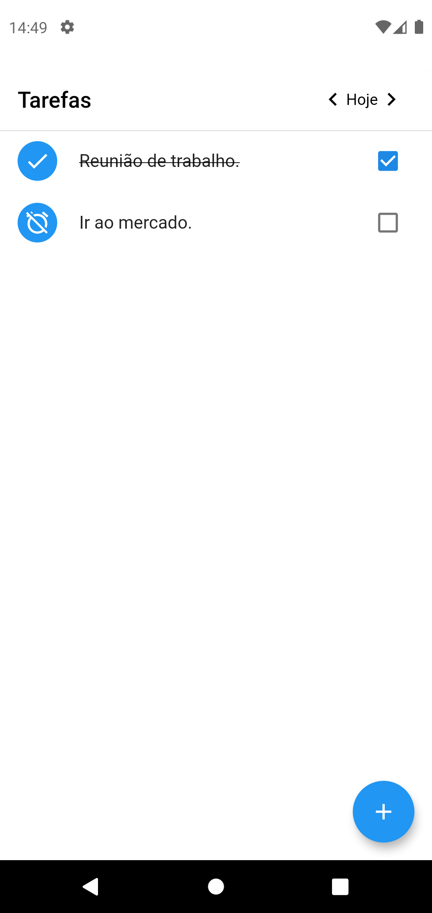
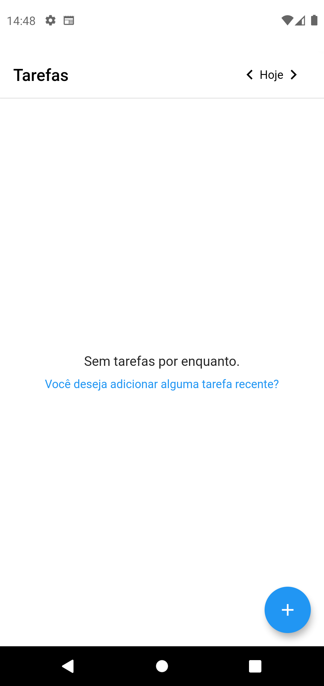

# Task app

Task app made with Flutter.

## Getting started

Clone this repo.

```bash
git clone https://github.com/jpssantiago/task-app
```

Install dependencies

```bash
flutter pub get
```

Enjoy :)

```bash
flutter run
```

## Images




## License
[MIT](LICENSE)